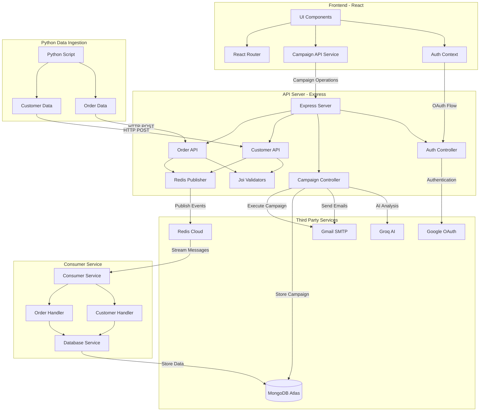

<p align="center">
  
</p>

<h1 align="center">CRMint 🚀</h1>
<p align="center">AI-Powered CRM for Campaigns & Customer Insights</p>

### 

A modern CRM platform featuring real-time data ingestion, intelligent customer segmentation, and AI-driven campaign insights.


## ✨ Key Features

### 🔐 Authentication & Security
- **Google OAuth 2.0** integration for secure login
- Protected routes and API endpoints
- Session management with Express
- CORS configured for secure client-server communication

### 📊 Data Management
- **Redis Streams** for scalable data ingestion
- Real-time customer and order processing
- Asynchronous MongoDB persistence
- Joi validation for data integrity

### 🎯 Campaign Management
- Dynamic segment builder with AND/OR conditions
- Rule-based customer filtering:
  ```javascript
  {
    field: "spend",
    operator: ">",
    value: 10000
  }
  ```
- Preview audience size before campaign launch
- Email campaign execution with delivery tracking

### 🤖 AI-Powered Insights
- Campaign performance analysis using Groq AI
- Natural language summaries
- Actionable recommendations
- Automated insight generation

## 🏗️ Architecture

## System Architecture



## 🛠️ Tech Stack

### Backend
- **Node.js & Express** - API server
- **Redis Streams** - Message Broker
- **MongoDB & Mongoose** - Database
- **Passport.js** - Authentication
- **Groq SDK** - AI integration
- **Joi** - Validation
- **Nodemailer** - Email service

### Frontend
- **React** - UI framework
- **TailwindCSS** - Styling
- **React Router** - Navigation
- **Context API** - State management

## 🚀 Getting Started

### Prerequisites
- Node.js (v16+)
- Redis
- MongoDB
- Google OAuth credentials
- Groq API key

### Installation

1. Clone the repository:
```bash
git clone https://github.com/ImKartikey27/crmint.git
cd crmint
```

2. Backend setup:
```bash
cd backend
npm install
cp .env.example .env
```

3. Configure environment variables:
```env
PORT=8000
MONGODB_URI=your_mongodb_uri
REDIS_PASSWORD=your_redis_password
GOOGLE_CLIENT_ID=your_google_client_id
GOOGLE_CLIENT_SECRET=your_google_client_secret
SESSION_SECRET=your_session_secret
GROQ_API_KEY=your_secret_api_key
GOOGLE_EMAIL=your_email_id
GOOGLE_PASSWORD=your_secure_password

```

4. Frontend setup:
```bash
cd frontend
npm install
cp .env.example .env
```

5. Start the services:
```bash
# Terminal 1 - API Server
cd backend
npm run dev

# Terminal 2 - Frontend
cd frontend
npm run dev
```

## 📁 Project Structure

```
Time2Manage/
├── backend/
│   ├── api-server/
│   │   ├── controllers/
│   │   ├── middlewares/
│   │   ├── routes/
│   │   ├── services/
│   │   └── utils/
│   └── consumer-services/
│       ├── consumers/
│       ├── models/
│       └── utils/
└── frontend/
|   ├── src/
|   │   ├── components/
|   │   ├── pages/
|   │   ├── context/
|   │   └── utils/
|   |── public/
|   |__app/
|__Public/
|  |___logo.png
|  |___github_logo.png
|
|__venv/
|__.gitignore
|__readme.md
|__script.py
```

## 🔄 Data Flow

1. **Data Ingestion**
   - Frontend submits customer/order data
   - API validates and publishes to Redis Stream
   - Consumer service processes stream messages
   - Data persisted to MongoDB

2. **Campaign Creation**
   - Build segment rules through UI
   - Preview affected audience
   - Save campaign configuration
   - Execute email delivery

3. **AI Insights**
   - Campaign stats collected
   - Sent to Groq AI for analysis
   - Natural language insights generated
   - Displayed in dashboard

## 🤝 Contributing

1. Fork the repository
2. Create your feature branch (`git checkout -b feature/AmazingFeature`)
3. Commit changes (`git commit -m 'Add some AmazingFeature'`)
4. Push to branch (`git push origin feature/AmazingFeature`)
5. Open a Pull Request

## 📝 License

Distributed under the MIT License. See `LICENSE` for more information.

## 📧 Contact

Kartikey Sangal - [@ImKartikey27](https://x.com/KartikeySa5866)

 [crmint](https://github.com/ImKartikey27/crmint.git)

 [YourUsername](https://www.linkedin.com/in/kartikey-sangal-752567301/)


